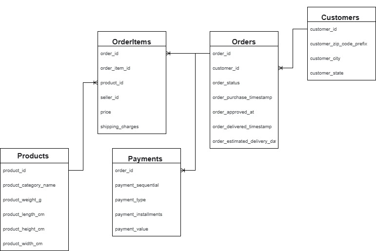

# Template для паспортной записки по таблице

### 1. Общая информация
**Название таблицы:** Orders

**Источник / файл:** Kaggle, [Ecommerce Order & Supply Chain Dataset](https://www.kaggle.com/datasets/bytadit/ecommerce-order-dataset), файл df_Orders.csv

**Роль в модели:** факт-таблица заказов

**Краткое описание (1–2 предложения):** Таблица заказов интернет‑магазина (Orders): одна строка = один заказ, включает статусы, ключевые даты и рассчитанные длительности ключевых этапов (от покупки до одобрения и до доставки) для анализа SLA (Service Level Agreement, соглашение об уровне сервиса) и динамики заказов.

### 2. Структура и ключи
**Первичный ключ:** order_id (уникален, дубликатов нет, одна строка = один заказ)

**Важные внешние ключи:**

|Поле таблицы Orders|Связанная таблица    |Тип связи|
|-------------------|---------------------|---------|
|customer_id        |Customers.customer_id|N:1      |
|order_id           |OrderItems.order_id  |1:N      |
|order_id           |Payments.order_id    |1:N      |

**Количество строк:**

**Количество столбцов:**

### 3. Основные поля (короткий список)
Топ‑5–10 полей, которые используются чаще всего.

Формат:

<column_name> — тип, значение, краткое описание.
Пример:

purchase_date — datetime, дата и время оформления заказа.

order_status — category/string, статус жизненного цикла заказа (delivered, canceled, shipped, …).

Если хочешь, можно сделать небольшую табличку:

|Column|Type|Description|
|------|----|-----------|
|purchase_date|datetime|Дата и время оформления заказа|
|approved_date|datetime|Дата и время одобрения заказа|
|delivered_date|datetime|Фактическая дата доставки заказа|
|estimated_delivery_date|datetime|Ожидаемая дата доставки заказа|

### 4. Качество данных
Пропуски по ключевым полям: (что проверяли, доли пропусков)

Дубликаты: (по ключу, по важным комбинациям)

Аномалии: (отрицательные длительности, слишком большие значения, странные статусы и т.п.)

Принятые решения по очистке:
* что исключаем из расчётов,
* что считаем «как есть»,
* какие флаги/колонки завели для контроля качества.

Пример формулировок:

«В purchase_date пропусков нет; в delivered_date ≈2.1% пропусков (недоставленные/отменённые заказы).»

«Обнаружены 53 заказа с отрицательной длительностью approved_to_delivered_days; для расчёта временных метрик они исключаются.»

### 5. Производные показатели (calculated fields)
Список вычисленных колонок, которые считаешь стандартными для анализа:
* purchase_to_approved_days — float (дни), от покупки до одобрения.
* approved_to_delivered_days — float (дни), от одобрения до доставки.
* purchase_to_delivered_days — float (дни), полный цикл.
* purchase_hour — int, час оформления заказа (0–23).

Для каждой: коротко, как она считается и зачем нужна.

### 6. Типичные агрегаты и использования
Для чего эта таблица используется в отчётах/дашбордах:

«Динамика количества заказов по дням/неделям/месяцам.»

«Время доставки по статусу, SLA.»

«Распределение заказов по часам суток.»

Какие фильтры считаем «базовыми настройками»:

«При расчёте метрик по времени доставки используем только order_status = 'delivered' и исключаем отрицательные длительности.»

«Анализ сезонности строим по purchase_date в разрезе месяцев и лет.»

### 7. Ограничения и оговорки
Какие есть ограничения датасета:

ограниченный период наблюдений;

отсутствие повторных покупок (если так);

данные синтетические/анонимизированные.

Что нельзя однозначно интерпретировать (например, долгие доставки без географических признаков).
